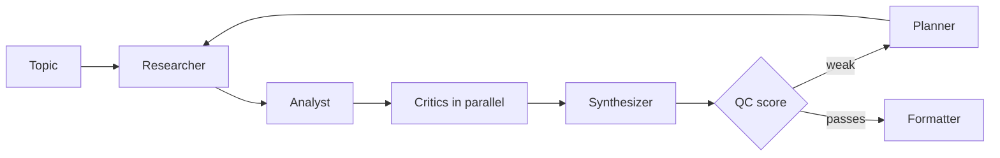

# Harsh Shroff

**I build agents and edge models, then try to break them.** Most AI demos stop at "it works on my prompt." I keep going until there's a number, and I put the number where you can check it.

[Portfolio](https://harshshroff.github.io) · [LinkedIn](https://linkedin.com/in/harshroff) · [Email](mailto:harshrofff@gmail.com) · Open to AI/ML engineering roles, especially forward-deployed and applied-agent work.

## Receipts

| Claim | Number | Check it |
|---|---|---|
| vLLM beats a naive Hugging Face loop | **1.6x to 2.2x** throughput, one T4, Qwen2.5-3B | [results](https://github.com/HarshShroff/vllm-inference-benchmark) |
| Agent finds cell-level drug effects | **0.92** segmentation F1, **98%** outlier precision on BBBC021 | [Bio-Oracle](https://github.com/HarshShroff/Bio-Oracle) |
| A percentile bug in a benchmarking tool | wrong in **286 of 4,444** cases on main, **0** on the fix | [my review of guidellm #1194](https://github.com/vllm-project/guidellm/pull/1194) |
| A scoring engine you can audit | **15** factors, **118+** tests | [Silicon Oracle](https://github.com/HarshShroff/Silicon-Oracle) |

## What I've built

**[MARS](https://github.com/HarshShroff/multi-agent-researcher)** turns a topic into a citation-grounded report using eleven LangGraph agents. The part I care about is the QC agent: it scores every draft and sends weak ones back through a planner instead of shipping them.

*Simplified from the LangGraph wiring in `graph.py`. Runs as a Streamlit app and as an MCP server other clients can call.*

**[Bio-Oracle](https://github.com/HarshShroff/Bio-Oracle)** puts a reasoning agent on top of Cellpose segmentation for drug-discovery screens. **[Silicon Oracle](https://github.com/HarshShroff/Silicon-Oracle)** is a stock-analysis platform (educational, not advice). On the edge side I work with offline vision-language models, speech pipelines and NVIDIA Jetson hardware.

## How I work

- **Measure first.** A claim without a number is a guess.
- **Check the checker.** A validator that can't be wrong is a validator nobody tested.
- **Offline by default.** If it only works with a good connection, it isn't done.

## Lately

Reading and reviewing code in the vLLM ecosystem, and looking for the next thing worth measuring.

M.S. Data Science, UMBC · AWS Certified Machine Learning · Python, LangGraph, PydanticAI, MCP, vLLM, Jetson, YOLOv8, CLIP, AWS, Docker
