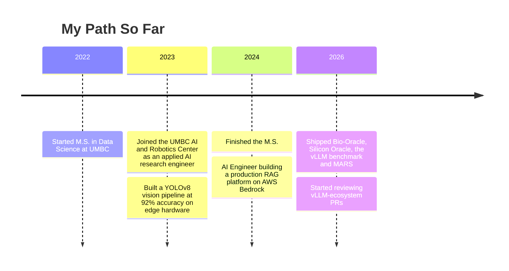

 

  
  
  
  
  

---

## About Me

I build agentic systems and on-device vision-language models, and I measure them. Multi-agent pipelines with quality checks that catch their own mistakes, and offline models that run on the hardware a person actually carries.

- M.S. Data Science, **UMBC** (3.8 GPA), AWS Certified Machine Learning
- Applied AI research engineer, UMBC AI and Robotics Center: multimodal perception and multi-agent orchestration for field robots
- Reviewing inference-tooling PRs in the vLLM ecosystem, with checks I reproduce first

---

## Featured Projects

<table>
<tr>
<td width="50%" valign="top">

### [MARS](https://github.com/HarshShroff/multi-agent-researcher)
*Research reports that check their own sources*

Eleven LangGraph agents turn a topic into a citation-grounded report. A QC agent scores each draft and sends weak ones back for another pass, and a verifier checks every source. Runs as a Streamlit app and as an MCP server other clients can call.

**Stack:** Python · LangGraph · Pydantic · MCP · Gemini · Streamlit

`#agents` `#evals` `#mcp`

</td>
<td width="50%" valign="top">

### [vLLM benchmark](https://github.com/HarshShroff/vllm-inference-benchmark)
*Testing the vendor claim instead of repeating it*

vLLM's continuous batching against a naive Hugging Face generate loop on one T4 with Qwen2.5-3B: roughly 1.6x to 2.2x the throughput on matched workloads. Harness, prompts, raw results and plots are all in the repo.

**Stack:** Python · vLLM · PyTorch · Colab

`#inference` `#benchmarks`

</td>
</tr>
<tr>
<td width="50%" valign="top">

### [Bio-Oracle](https://github.com/HarshShroff/Bio-Oracle)
*Drug-discovery screening with a reasoning agent on top*

Cellpose segments microscopy images, then a PydanticAI agent answers questions like "which compounds hit the cytoskeleton" using outlier statistics over the extracted features. Validated on the public BBBC021 dataset.

**Stack:** Python · Cellpose · PydanticAI · Gemini · Docker

`#agents` `#vision` `#biotech`

</td>
<td width="50%" valign="top">

### [Silicon Oracle](https://github.com/HarshShroff/Silicon-Oracle)
*Stock analysis with a scoring engine you can audit*

A 15-factor scoring engine, a paper-trading tracker and Gemini-written alerts, with encrypted bring-your-own-key access. Educational, not investment advice.

**Stack:** Flask · PostgreSQL · Supabase · Gemini · pytest

`#fullstack` `#llm`

</td>
</tr>
</table>

---

## Journey

---

## Tech I Reach For

  
  
  
  
  
  
  
  

Also: MCP · PydanticAI · Ollama · YOLOv8 · CLIP · DINOv2 · Cellpose · Flask · JavaScript · C · Bash

---

  Open-source reviews: <a href="https://github.com/vllm-project/guidellm/pull/1194">guidellm #1194</a> · <a href="https://github.com/vllm-project/vllm/pull/56918">vLLM #56918</a> · <a href="https://github.com/vllm-project/guidellm/pull/1182">guidellm #1182</a>

