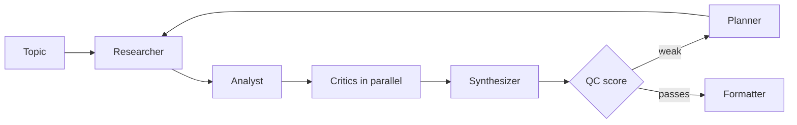

# Harsh Shroff

**I build agents and edge models, then try to break them.** Most AI demos stop at "it works on my prompt." I keep going until there's a number, and I put the number where you can check it.

[Portfolio](https://harshshroff.github.io) · [LinkedIn](https://linkedin.com/in/harshroff) · [Email](mailto:harshrofff@gmail.com) · Open to AI/ML engineering roles, especially forward-deployed and applied-agent work.

## Receipts

| Claim | Number | Check it |
|---|---|---|
| vLLM beats a naive Hugging Face loop | **1.6x to 2.2x** throughput, one T4, Qwen2.5-3B | [results](https://github.com/HarshShroff/vllm-inference-benchmark) |
| Agent finds cell-level drug effects | **0.92** segmentation F1, **98%** outlier precision on BBBC021 | [Bio-Oracle](https://github.com/HarshShroff/Bio-Oracle) |
| A percentile bug in a benchmarking tool | wrong in **286 of 4,444** cases on main, **0** on the fix | [my review of guidellm #1194](https://github.com/vllm-project/guidellm/pull/1194) |
| A scoring engine you can audit | **15** factors, **118+** tests | [Silicon Oracle](https://github.com/HarshShroff/Silicon-Oracle) |

## Featured Projects

<table>
<tr>
<td width="50%" valign="top">

### [MARS](https://github.com/HarshShroff/multi-agent-researcher)
*Research reports that send weak drafts back*

Eleven LangGraph agents turn a topic into a citation-grounded report. A QC agent scores every draft and loops weak ones back through a planner instead of shipping them. Runs as a Streamlit app and as an MCP server other clients can call.

**Stack:** Python · LangGraph · Pydantic · MCP · Gemini · Streamlit

`#agents` `#evals` `#mcp`

</td>
<td width="50%" valign="top">

### [vLLM benchmark](https://github.com/HarshShroff/vllm-inference-benchmark)
*Testing the vendor claim instead of repeating it*

vLLM's continuous batching against a naive Hugging Face generate loop, one T4, Qwen2.5-3B. Harness, fixed prompts, raw results and plots are in the repo so anyone can rerun it.

**Stack:** Python · vLLM · PyTorch · Colab

`#inference` `#benchmarks`

</td>
</tr>
<tr>
<td width="50%" valign="top">

### [Bio-Oracle](https://github.com/HarshShroff/Bio-Oracle)
*A reasoning agent on top of cell segmentation*

Cellpose segments microscopy images, then a PydanticAI agent answers screening questions using outlier statistics over the extracted features. Validated on the public BBBC021 drug-screen dataset.

**Stack:** Python · Cellpose · PydanticAI · Gemini · Docker

`#agents` `#vision` `#biotech`

</td>
<td width="50%" valign="top">

### [Silicon Oracle](https://github.com/HarshShroff/Silicon-Oracle)
*Stock analysis with a scoring engine you can audit*

A 15-factor scoring engine, a paper-trading tracker and Gemini-written alerts, with encrypted bring-your-own-key access. Educational, not investment advice.

**Stack:** Flask · PostgreSQL · Supabase · Gemini · pytest

`#fullstack` `#llm`

</td>
</tr>
</table>

How MARS routes a draft (simplified from <code>graph.py</code>)

On the edge side I work with offline vision-language models, speech pipelines and NVIDIA Jetson hardware.

## How I work

- **Measure first.** A claim without a number is a guess.
- **Check the checker.** A validator that can't be wrong is a validator nobody tested.
- **Offline by default.** If it only works with a good connection, it isn't done.

## Lately

Reading and reviewing code in the vLLM ecosystem, and looking for the next thing worth measuring.

M.S. Data Science, UMBC · AWS Certified Machine Learning · Python, LangGraph, PydanticAI, MCP, vLLM, Jetson, YOLOv8, CLIP, AWS, Docker
